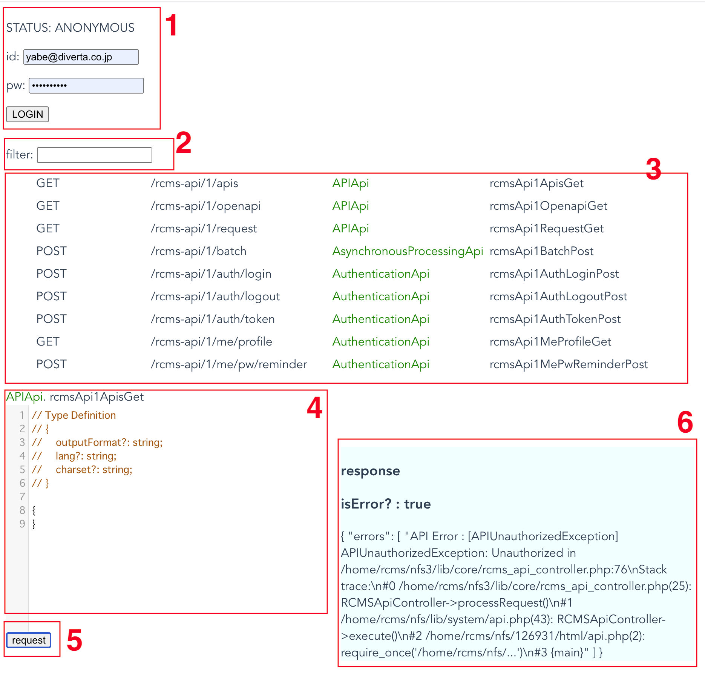
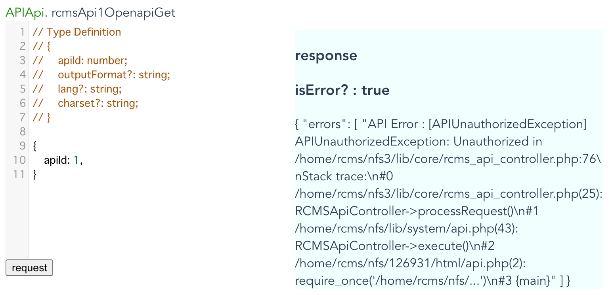
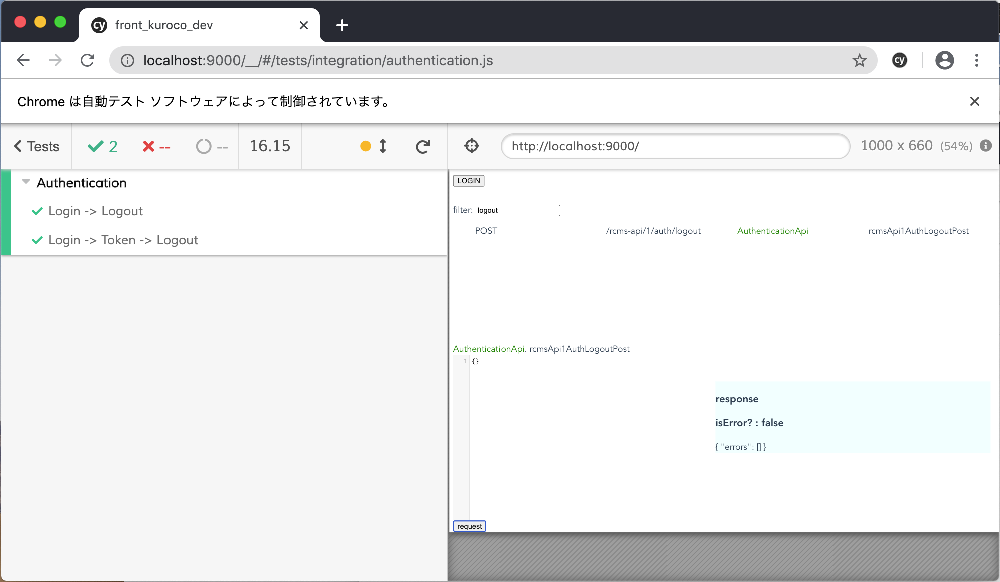

# front_kuroco_dev

> 本アプリは、Kuroco サーバまで直接リクエストし、結果を画面表示するものです。
> https://kuroco-dev.web.app/

## 概要

本アプリは、Kuroco サーバまで直接リクエストし、結果を画面表示するものです (<a href="#操作説明">操作説明</a>)。  
加えて,e2e のテストコードをこのアプリ上で動作させてテストを実行できます (<a href="#e2e-testing">e2e testing</a>)。

アプリを立ち上げるには `npm run serve`,  
e2e テストを立ち上げるには `npm run test:e2e`  
を実行してください。

## インストール

本アプリを動作させるには git と node が必要です。  
事前にインストールしてください。

本リポジトリを clone した後,下記のコードを実行してください。  
`npm install && npm run serve`

## 操作説明



1. ログイン  
   最初に id,pw を入力してログインしてください。
2. 検索窓  
   or 検索でエンドポイントを検索できます。
3. エンドポイント一覧  
   Kuroco(SDK)が生成した API の一覧です。  
   どれかをクリックすると、その内容が JSON エディタに反映されます。
4. JSON エディタ  
   リクエストボディを作成するための入力部分です。  
   ここで編集した内容が実際に Kuroco へリクエストされます。  
   先頭の`//`でコメントされている部分は、SDK から出力している型定義情報です。  
   :warning: **<a href="#型の不一致について">Kuroco の APISchema と、ここで定義されている情報は異なることに注意してください</a>**
5. リクエストボタン  
   JSON エディタ内の内容を Kuroco へ送信します。
6. リザルト  
   リクエスト結果を表示します。  
   `isError: Boolean` 部分に、リクエストがエラーだったかどうかが表示されます。  
   その下に実際のレスポンス内容が表示されます。  
   (この画面サンプルの場合は、リクエストはエラーで、ApiUnauthorizedException が発生した旨のレスポンスが表示されています)

### 型の不一致について

APISchema と、SDK が生成する型定義は実際には異なります。

JSON エディタ内に作成したリクエストボディ用のデータは、  
直接そのまま Kuroco サーバへとリクエストされるのではなく、  
SDK を途中に介して変換され、最終的に Kuroco サーバへのリクエストされます。

このため、値を定義する際には、  
APISchema ではなくコメントで記載されている SDK 用の型定義情報を参考に値を定義してください。

例えば Kuroco の SwaggerUI に記載されている example をここにそのままコピーして実行しても、  
JS がエラーをスローする場合がありますので注意してください。

**例**
| NG | OK |
| --------------------------------------------------------------- | ------------------------------ |
|  |  |
| Schema は`api_id`が正しいですが、SDK の型定義とは異なるため、NG | SDK の型定義と合致するため、OK |

## e2e testing

`npm run test:e2e`を実行してください。  
cyprerss のダッシュボードが表示されます。  


実行したいテストを選択すると、  
chrome が立ち上がり、テストが実行されます。  


### テストファイルの作り方

test は本アプリの画面をコードから操作することで実施されます(e2e)。  
`executeRequest({ cy, query, requestData })`メソッドを通して実行してください。

- executeRequest
  - cy cypress instance object
  - query 一意のエンドポイントを検索する文字列
  - requestData エンドポイントにリクエストするオブジェクト

requestData については、  
変数として定義し、定義する行より一つ上に TypeScript 用のコメントを設定してください。  
このコメントを設定すると、SDK による型チェックが自動で動作します。  
型エラーが表示されている場合には適宜修正してください。

**:warning: エディタは VisualStudioCode で編集してください**  
**:warning: `@type`アノテータには,DynamicImport を使用してください(JS 内で TS を読み込むために RuntimeError となるのを防ぐ)**

```javascript
// DO NOT USE import *** from '../../../generated/***' SYNTAX.
// TS CHECKS IN A JS FILE DOES NOT SUPPORT IMPORTS, USE DYNAMIC IMPORTS ALONG WITH COMMENT SECTION INSTEAD.
/** @type {import('../../../generated/services/AuthenticationService').AuthenticationService.postAuthenticationServiceRcmsApi1AuthLoginRequest} */
const requestData = {
  requestBody: {
    email: 'test',
    password: 'qwer1234',
  },
};
return executeRequest({
  cy,
  query: 'login',
  requestData,
});
```

その他具体的なソースコードについては、  
`tests/e2e/specs/*.js`を参考にしてください。

### テスト観点について

下記のパターンでテスト用 javascript ファイルを作成し、e2e でテストを実施してください。

- シナリオテスト
  - API のモジュール単位で javascript ファイルを用意し,ユーザーの操作想定シナリオ通りにテストコードを書きます。  
    javascript のファイル名はモジュールの名前と同じにして,`scenario`フォルダ内に保存してください。  
    例: `tests/e2e/specs/scenario/Authentication.js:`  
    `login -> token -> logout,`  
    `...`
- パターンテスト
  - API のモジュール単位で javascript ファイルを用意し,想定されうるリクエストのパターンを用意して,それぞれテストコードを書きます。  
    javascript のファイル名はモジュールの名前と同じにして,`pattern`フォルダ内に保存してください。  
    例: `tests/e2e/specs/pattern/Authentication.js:`  
    `login(email: "xxx"),`  
    `login(email: "test@example.com"),`  
    `login(email: "test@example.com", password: ""),`  
    `login(email: "test@example.com", password: "pw"),`  
    `...`
- その他のテスト
  - その他上記に当てはまらないテストです。  
    javascript のファイル名は自由,`etc`フォルダ内に保存してください。  
    例: `tests/e2e/specs/etc/Authentication.js:`  
    `loginButFailedByNoMatchedUser(email: "no-mathing-user", password: "pw"),`  
    `tokenButFiledByInvalidToken(auth_token: "invalidtoken"),`  
    `...`

### その他

- Kuroco が更新された時はどうすれば良い？
  - `npm run update:kuroco` を実行してください。  
    自動で Kuroco 用のソースコードが更新されます。  
    Kuroco 用のコードが更新されていることで、それを利用するテスト内の javascript ファイルも更新が必要かもしれません。  
    そちらも確認いただき、特にエディタ上で SyntaxError が発生していないかをチェックしてください。

### Firebase hosting へのアップロード

`npm run deploy` を実行してください。

#### firebase hosting deploy initializing

`firebase deploy`  
アップロードするディレクトリは dist  
index.html にリクエストを集約する？ YES  
index.html を上書きする？ NO

`cd ./front_kuroco_dev`  
`firebase init`  
ブラウザでログインして、  
Firebace hosting を Space キーで選択して、Enter  
プロジェクトは kuroco-dev を選択
