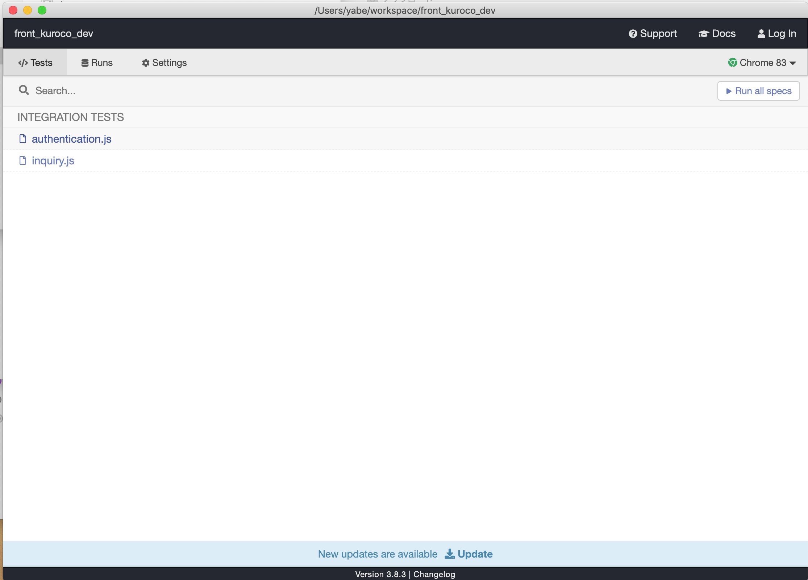

# fron_kuroco_dev

## App

本アプリは、Kuroco サーバまで直接リクエストし、結果を画面表示するものです。


1. ログイン  
   最初に id,pw を入力してログインしてください。
2. 検索窓  
   or 検索でエンドポイントを検索できます。
3. エンドポイント一覧  
   Kuroco(SDK)が生成した API の一覧です。  
   どれかをクリックすると、その内容が JSON エディタに反映されます。
4. JSON エディタ  
   リクエストボディを作成するための入力部分です。  
   ここで編集した内容が実際に Kuroco へリクエストされます。  
   先頭の`//`でコメントされている部分は、SDK から出力している型定義情報です。  
   **Kuroco の APISchema と、ここで定義されている情報は異なることに注意してください。**
5. リクエストボタン  
   JSON エディタ内の内容を Kuroco へ送信します。
6. リザルト  
   リクエスト結果を表示します。  
   `isError: Boolean` 部分に、リクエストがエラーだったかどうかが表示されます。  
   その下に実際のレスポンス内容が表示されます。  
   (この画面サンプルの場合は、リクエストはエラーで、ApiUnauthorizedException が発生した旨のレスポンスが表示されています)

## e2e testing

ローカルにリポジトリをクローンし、  
`npm i`を実行してください。

`npm run test:e2e`を実行してください。  
cyprerss のダッシュボードが表示されます。  


実行したいテストを選択すると、  
chrome が立ち上がり、テストが実行されます。  


- test ファイルの作り方

test は本アプリの画面をコードから操作することで実施されます(e2e)。  
`executeRequest({ cy, query, requestData })`メソッドを通して実行してください。

- executeRequest
  - cy cypress instance object
  - query 一意のエンドポイントを検索する文字列
  - requestData エンドポイントにリクエストするオブジェクト

requestData については、  
変数として定義し、定義する行より一つ上に TypeScript 用のコメントを設定してください。  
このコメントを設定すると、SDK による型チェックが自動で動作します。  
型エラーが表示されている場合には適宜修正してください。

```javascript
/** @type {import('kuroco').AuthenticationApiRcmsApi1AuthLoginPostRequest} */
const requestData = {
  inlineObject: {
    email: 'test',
    password: 'qwer1234',
  },
};
executeRequest({
  cy,
  query: 'login',
  requestData,
});
```

その他具体的なソースコードについては、  
`tests/e2e/specs/*.js`を参考にしてください。
